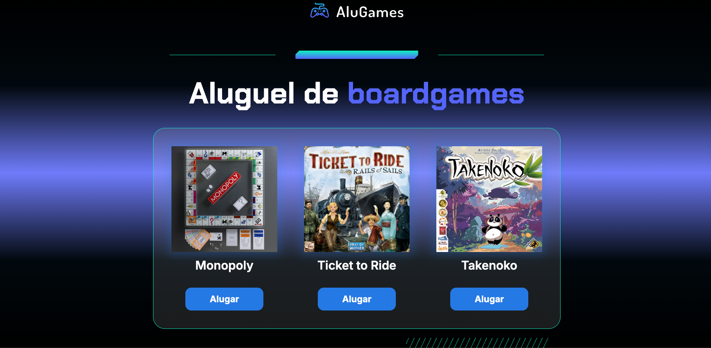

## Screenshots
 

 A game rental store, where you can rent and return your favorite games.

## Interface
* When we click on `Rent` the button darkens as does the image, in addition, the site starts a count in the `console.log` of how many games you have already rented.
* If we click on `Return`, the button returns to its original color, so does the photo and a message is presented to the user, asking if they are sure they want to proceed with the return.

## Technologies
* HTML
* CSS
* JavaScript
